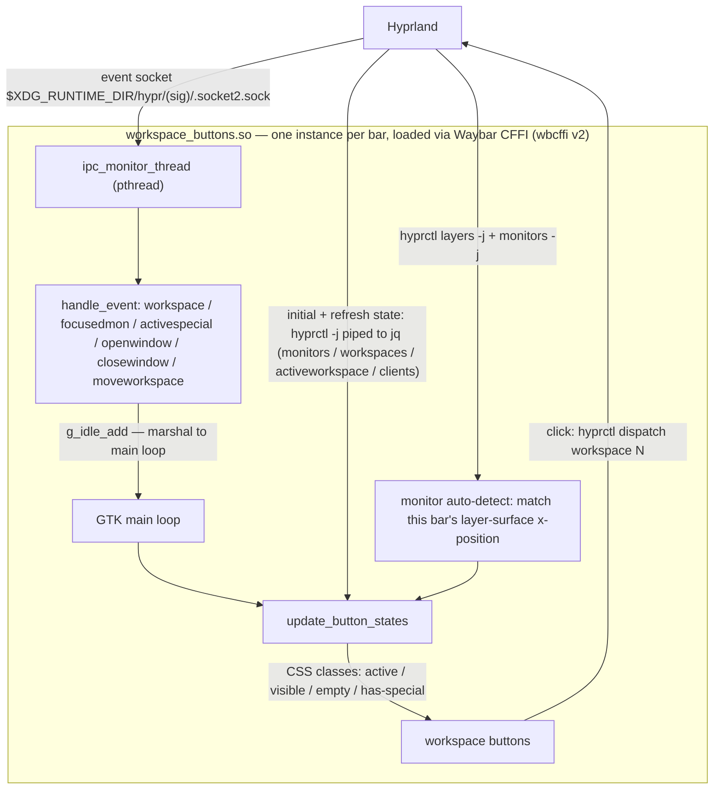

# Waybar Workspace Buttons

A fast, event-driven CFFI module for [Waybar](https://github.com/Alexays/Waybar) that displays Hyprland workspace buttons with real-time updates.

## Features


- **Per-monitor workspace filtering** - Each bar shows only its monitor's workspaces
- **Active workspace highlighting** - Different styles for focused vs unfocused monitors
- **Special workspace indicators** - Dot overlay shows workspaces with windows in `special:N`
- **Empty workspace hiding** - Configurable to show/hide empty workspaces
- **Event-driven updates** - Parses Hyprland IPC events directly for instant response
- **Click to switch** - Click any button to switch to that workspace

## Why This Module?

The built-in Waybar Hyprland module spawns multiple subprocesses on every workspace event. This module:
- Connects directly to Hyprland's IPC socket
- Parses events in-process without spawning shells
- Only queries `hyprctl` when window counts change
- Results in near-instant UI updates with minimal CPU overhead

## Architecture



## Building

Requires: `meson`, `ninja`, `gtk3-devel`, `json-glib-devel`

```bash
meson setup build
ninja -C build
```

## Installation

Copy the built module to your Waybar config directory:

```bash
mkdir -p ~/.config/waybar/cffi
cp build/workspace_buttons.so ~/.config/waybar/cffi/
```

## Configuration

Add to your Waybar config (`~/.config/waybar/config`):

```json
{
    "modules-left": ["cffi/workspaces"],

    "cffi/workspaces": {
        "module_path": "~/.config/waybar/cffi/workspace_buttons.so",
        "all-outputs": false,
        "show-empty": false
    }
}
```

### Options

| Option | Type | Default | Description |
|--------|------|---------|-------------|
| `all-outputs` | bool | `false` | Show workspaces from all monitors |
| `show-empty` | bool | `false` | Show empty workspaces |
| `output` | string | auto | Override monitor name detection |

## Styling

Add to your Waybar CSS (`~/.config/waybar/style.css`):

```css
#workspaces button {
    padding: 0 8px;
    min-width: 24px;
    color: @text;
    background: transparent;
    border: none;
    border-radius: 4px;
}

#workspaces button.active {
    color: @primary;
    border-bottom: 2px solid @primary;
}

#workspaces button.visible {
    color: @secondary;
}

#workspaces button.empty {
    color: @surface2;
}

#workspaces button.has-special {
    /* Workspace has windows in special:N */
}
```

### CSS Classes

| Class | Meaning |
|-------|---------|
| `active` | Workspace is active AND monitor is focused |
| `visible` | Workspace is active but monitor is NOT focused |
| `empty` | Workspace has no windows (regular or special) |
| `has-special` | Workspace has windows in its `special:N` workspace |

## Special Workspace Integration

This module works with Hyprland's per-workspace special workspaces (`special:1` through `special:9`). When a workspace has windows in its corresponding special workspace, a colored dot indicator appears in the top-right corner of the button.

The dot color is read from `~/.config/matugen/lmtt-colors.css` (the `@tertiary` color) or falls back to `#adc8f8`.

### Example: per-workspace special zones

Hyprland doesn't tie special workspaces to regular ones by itself — the pairing
is a naming convention (`special:N` belongs to workspace `N`) plus a little
coordination. The setup below gives every workspace its own scratch zone:
one keybind toggles the current workspace's zone, another stashes the focused
window into it, and switching workspaces auto-dismisses whatever zone is open
(`togglespecialworkspace` only acts on the focused monitor, so the switch
command has to close it first).

Keybinds:

```ini
# Route workspace switching through the script so an open special zone
# closes before the switch instead of lingering over the new workspace.
bind = $mainMod, 1, exec, ~/.config/hypr/scripts/hypr-workspace switch 1
bind = $mainMod, 2, exec, ~/.config/hypr/scripts/hypr-workspace switch 2
# ... through 9

# Toggle the current workspace's special zone / stash the focused window in it
bind = $mainMod ALT, S, exec, ~/.config/hypr/scripts/hypr-workspace toggle-special
bind = $mainMod SHIFT ALT, S, exec, ~/.config/hypr/scripts/hypr-workspace move-to-special
```

`~/.config/hypr/scripts/hypr-workspace` (needs `jq` and `socat`):

```bash
#!/usr/bin/env bash
# Per-workspace special zones for Hyprland: workspace N owns special:N.
# switch          — change workspace, closing any open special zone first
# toggle-special  — toggle special:<current workspace>, with auto-dismiss
# move-to-special — move the focused window to special:<current workspace>
set -euo pipefail

RUNTIME_DIR="${XDG_RUNTIME_DIR:-/tmp}/hypr-workspace"
mkdir -p "$RUNTIME_DIR"

get_active_special() {
    # Returns the open special workspace name (e.g. "special:7") or empty
    hyprctl monitors -j | jq -r '.[] | select(.focused == true) | .specialWorkspace.name // empty'
}

get_workspace_monitor() {
    # Monitor ID a workspace lives on; empty if it doesn't exist yet
    hyprctl workspaces -j | jq -r --arg ws "$1" '.[] | select(.id == ($ws | tonumber)) | .monitorID // empty'
}

get_current_workspace() {
    hyprctl activeworkspace -j | jq -r '.id'
}

kill_listener() {
    local pid_file="$RUNTIME_DIR/listener-$1.pid"
    [[ -f "$pid_file" ]] && { kill "$(cat "$pid_file")" 2>/dev/null || true; rm -f "$pid_file"; }
}

# Auto-dismiss: when the workspace changes while special:N is open, close it.
# Listens on socket2 so there's no polling; exits after one event.
start_listener() {
    local ws="$1"
    local socket="${XDG_RUNTIME_DIR}/hypr/${HYPRLAND_INSTANCE_SIGNATURE}/.socket2.sock"
    local pid_file="$RUNTIME_DIR/listener-$ws.pid"
    (
        echo $$ > "$pid_file"
        socat -U - "UNIX-CONNECT:$socket" | while read -r line; do
            case "$line" in
                workspace\>\>*|workspacev2\>\>*)
                    # Only close if this zone is still the open one (prevents races)
                    if [[ "$(get_active_special)" == "special:$ws" ]]; then
                        hyprctl dispatch togglespecialworkspace "$ws" 2>/dev/null
                    fi
                    break
                    ;;
                activespecial\>\>*)
                    [[ "$(get_active_special)" != "special:$ws" ]] && break
                    ;;
            esac
        done
        rm -f "$pid_file"
    ) &
    disown
}

case "${1:-}" in
    switch)
        target="${2:?Usage: hypr-workspace switch <N>}"
        target_monitor=$(get_workspace_monitor "$target")
        focused_monitor=$(hyprctl monitors -j | jq -r '.[] | select(.focused == true) | .id')
        # A new workspace materializes on the focused monitor
        [[ -z "$target_monitor" ]] && target_monitor="$focused_monitor"

        # Only close the open zone when staying on this monitor —
        # togglespecialworkspace acts on the focused monitor only.
        if [[ "$target_monitor" == "$focused_monitor" ]]; then
            special=$(get_active_special)
            if [[ -n "$special" && "$special" != "null" ]]; then
                name="${special#special:}"
                kill_listener "$name"
                hyprctl dispatch togglespecialworkspace "$name"
            fi
        fi
        hyprctl dispatch workspace "$target"
        ;;
    toggle-special)
        ws=$(get_current_workspace)
        if [[ "$ws" -lt 0 ]]; then
            # Invoked from inside a special workspace: just close it
            name="$(get_active_special)"; name="${name#special:}"
            hyprctl dispatch togglespecialworkspace "$name"
            exit 0
        fi
        if [[ "$(get_active_special)" == "special:$ws" ]]; then
            kill_listener "$ws"
            hyprctl dispatch togglespecialworkspace "$ws"
        else
            hyprctl dispatch togglespecialworkspace "$ws"
            start_listener "$ws"
        fi
        ;;
    move-to-special)
        ws=$(get_current_workspace)
        [[ "$ws" -lt 0 ]] && exit 0
        hyprctl dispatch movetoworkspace "special:$ws"
        ;;
    *)
        echo "Usage: hypr-workspace {switch|toggle-special|move-to-special} [args]"
        exit 1
        ;;
esac
```

With this in place the module's `has-special` dot lights up on any workspace
whose zone holds windows, and clears when the zone empties.

## Hyprland Events Handled

The module listens for these events on the Hyprland IPC socket:

- `workspace>>N` - Workspace switch
- `focusedmon>>MONITOR,WS` - Monitor focus change
- `activespecial>>...` - Special workspace toggle
- `openwindow>>`, `closewindow>>`, `movewindow>>` - Window events
- `createworkspace>>`, `destroyworkspace>>` - Workspace lifecycle
- `moveworkspace>>` - Workspace moved to different monitor; re-derives this
  monitor's active workspace from `hyprctl monitors`

## License

MIT
