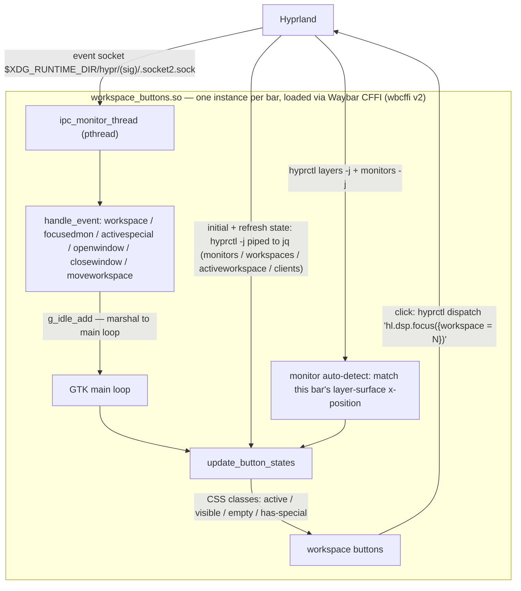

# Waybar Workspace Buttons

A fast, event-driven CFFI module for [Waybar](https://github.com/Alexays/Waybar) that displays Hyprland workspace buttons with real-time updates.

## Features


- **Per-monitor workspace filtering** - Each bar shows only its monitor's workspaces
- **Active workspace highlighting** - Different styles for focused vs unfocused monitors
- **Special workspace indicators** - Dot overlay shows workspaces with windows in `special:N`
- **Empty workspace hiding** - Configurable to show/hide empty workspaces
- **Event-driven updates** - Parses Hyprland IPC events directly for instant response
- **Click to switch** - Click any button to switch to that workspace (uses the
  Lua dispatch form, so Hyprland 0.55+ with a Lua config (`hyprland.lua`) is
  required for clicks to work)

## Why This Module?

The built-in Waybar Hyprland module spawns multiple subprocesses on every workspace event. This module:
- Connects directly to Hyprland's IPC socket
- Parses events in-process without spawning shells
- Only queries `hyprctl` when window counts change
- Results in near-instant UI updates with minimal CPU overhead

## Architecture



## Installation

### Arch Linux (pacman)

Prebuilt packages are published to the `[mason]` repo. Add to `/etc/pacman.conf`:

```ini
[mason]
# Import the signing key first: https://github.com/MasonRhodesDev/arch-repo#use-it
SigLevel = Required DatabaseRequired
Server = https://masonrhodesdev.github.io/arch-repo/x86_64
```

Then:

```bash
sudo pacman -Syu waybar-workspace-buttons
```

The module installs to `/usr/lib/waybar/workspace_buttons.so`. The Arch
package also ships `workspace-zones(7)` and
`/usr/lib/hyprland/plugins/libworkspace-zones.so` built against extra/hyprland.
New releases land in the repo automatically — update with `pacman -Syu` like
any other package. You can also build the same package yourself from
`packaging/PKGBUILD` with `makepkg`.

### Fedora (COPR)

```bash
sudo dnf copr enable solaris765/waybar-workspace-buttons
sudo dnf install waybar-workspace-buttons
```

The module installs to `/usr/lib64/waybar/workspace_buttons.so` (note
`lib64`). Releases are submitted with `packaging/build-srpm.sh --copr` from
the release tag. The workspace-zones Hyprland plugin is **not** in the RPM —
it is ABI-locked to the exact Hyprland build it runs on, so install it
through hyprpm (below), which rebuilds it against your compositor.

### From source

Requires: `meson`, `ninja`, `gtk3-devel`, `json-glib-devel`

```bash
meson setup build
ninja -C build
```

Then either `sudo meson install -C build` (installs to
`/usr/lib/waybar/workspace_buttons.so`) or run `./install.sh`, which copies
the module to `~/.config/waybar/cffi/workspace_buttons.so` for a per-user
install.

## Configuration

Add to your Waybar config (`~/.config/waybar/config`):

```json
{
    "modules-left": ["cffi/workspaces"],

    "cffi/workspaces": {
        "module_path": "/usr/lib/waybar/workspace_buttons.so",
        "all-outputs": false,
        "show-empty": false
    }
}
```

(Point `module_path` at `~/.config/waybar/cffi/workspace_buttons.so` instead
if you used `install.sh`.)

### Options

| Option | Type | Default | Description |
|--------|------|---------|-------------|
| `all-outputs` | bool | `false` | Show workspaces from all monitors |
| `show-empty` | bool | `false` | Show empty workspaces |
| `output` | string | auto | Override monitor name detection |

## Styling

Add to your Waybar CSS (`~/.config/waybar/style.css`):

```css
#workspaces button {
    padding: 0 8px;
    min-width: 24px;
    color: @text;
    background: transparent;
    border: none;
    border-radius: 4px;
}

#workspaces button.active {
    color: @primary;
    border-bottom: 2px solid @primary;
}

#workspaces button.visible {
    color: @secondary;
}

#workspaces button.empty {
    color: @surface2;
}

#workspaces button.has-special {
    /* Workspace has windows in special:N */
}
```

### CSS Classes

| Class | Meaning |
|-------|---------|
| `active` | Workspace is active AND monitor is focused |
| `visible` | Workspace is active but monitor is NOT focused |
| `empty` | Workspace has no windows (regular or special) |
| `has-special` | Workspace has windows in its `special:N` workspace |

## Special Workspace Integration

This module works with Hyprland's per-workspace special workspaces (`special:1` through `special:9`). When a workspace has windows in its corresponding special workspace, a colored dot indicator appears in the top-right corner of the button.

The dot color comes from `lmtt tokens --key tertiary`, or `#adc8f8` if LMTT is unavailable.

### Per-workspace special zones (Hyprland plugin)

This repo also ships **workspace-zones**, a small Hyprland plugin that gives
every numeric workspace its own scratch zone: workspace `N` owns `special:N`.
It is the setup the `has-special` dot was built for.

On Arch extra/hyprland the plugin is in the package. hyprland-git and Fedora
still need hyprpm, because the plugin is ABI-locked to the running compositor:

```sh
hyprpm add https://github.com/MasonRhodesDev/waybar-workspace-buttons
hyprpm enable workspace-zones
```

The plugin requires Hyprland **0.56+** with the **Lua config** (`hyprland.lua`)
— the only supported configuration. Classic `zones:*` string dispatchers no
longer exist: Hyprland's 0.56 keybinds refactor removed string dispatchers
compositor-wide. Bind the first-party functions under `hl.plugin.zones` —
your plain `hl.bind` workspace binds stay as they are:

```lua
hl.bind("SUPER + ALT + S",         function() hl.plugin.zones.toggle() end)
hl.bind("SUPER + ALT + SHIFT + S", function() hl.plugin.zones.move() end)
hl.bind("SUPER + CTRL + ALT + S",  function() hl.plugin.zones.movesilent() end)
```

Leaving a workspace closes its zone automatically, no matter how the switch
happened — keybind, bar click, `hyprctl` — so a zone never lingers over an
unrelated workspace. Named specials (`special:magic`, ...) are never touched.
To keep zones open across switches instead:

```ini
plugin:workspace-zones:auto_dismiss = 0
```

`man workspace-zones` is the full reference. hypr-DE's help window
(`hypr-de-help`, SUPER+/) explains how zones differ from the named
scratchpad.

To dismiss *named* specials on workspace switches too, no plugin needed —
Hyprland's own `binds:hide_special_on_workspace_change = true` does it, scoped
to the target workspace's monitor (a special open on another monitor stays),
and it also covers switching to the workspace already underneath the special.

## Hyprland Events Handled

The module listens for these events on the Hyprland IPC socket:

- `workspace>>N` - Workspace switch
- `focusedmon>>MONITOR,WS` - Monitor focus change
- `activespecial>>...` - Special workspace toggle
- `openwindow>>`, `closewindow>>`, `movewindow>>` - Window events
- `createworkspace>>`, `destroyworkspace>>` - Workspace lifecycle
- `moveworkspace>>` - Workspace moved to different monitor; re-derives this
  monitor's active workspace from `hyprctl monitors`

## License

MIT
